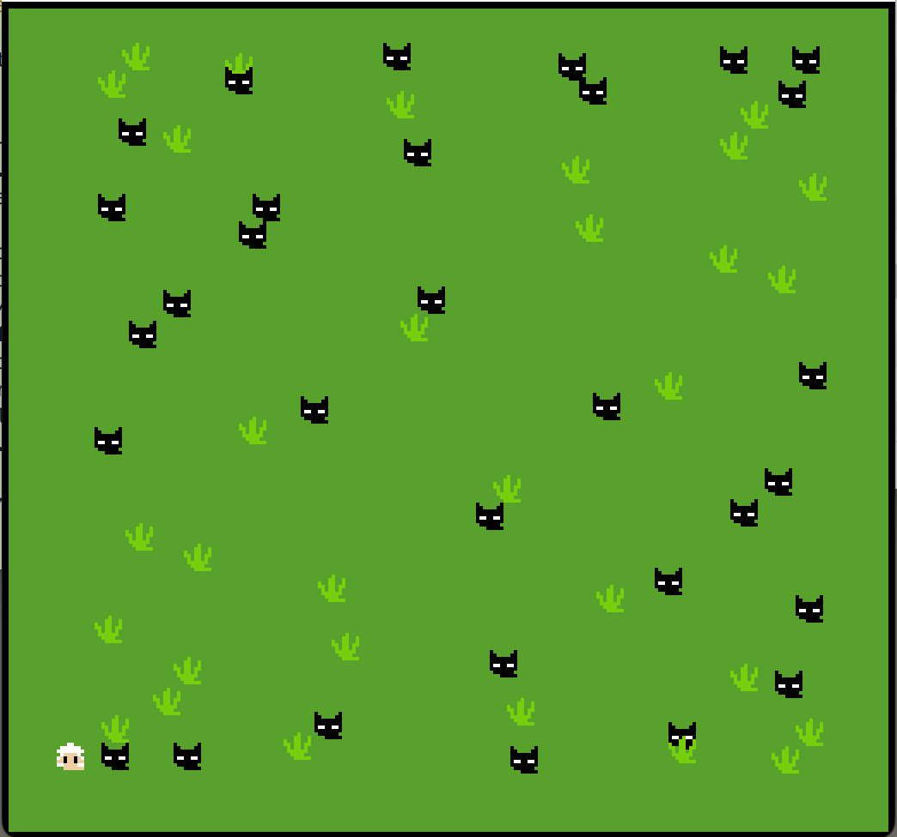

# Sheep Survival: To Eat or To Be Eaten

Author: Sheng JIN

Design: The player's goal is to touch as many some of the tiles (grass) as possible, while avoiding other tiles (wolfs). It has both positive reward and negative reward.

Screen Shot:

How Your Asset Pipeline Works:

I use GIMP to draw four tiles: sheep, wolf, grass and background. Each of them has 8x8 pixels. The tiles are saved in png format used for runtime code. There is also a metadata file called metadata.txt, which contains the tile id, the name of the tile, and the relative path to the png file. The runtime code first load the metadata.txt. Then it loads the tiles using the `load_png()` function. After loading, the palette is extracted from the png file, and the `Sprite` instances are set, (including the palette field, the tile field, and some attributes used for the game).

(TODO: make sure the source files you drew are included. You can [link](your/file.png) to them to be a bit fancier.) Done

How To Play:

In this game, you (as the player) are a hungry sheep. Fortunately, there is plenty grass for you to eat. Unfortunately, there are plenty wolfs to eat you. Use arrow keys to control the sheep to move, try to eat all the grass, and not caught by any wolf. Whenever you are caught or you eat all the grass, the game restarts.

This game was built with [NEST](NEST.md).

